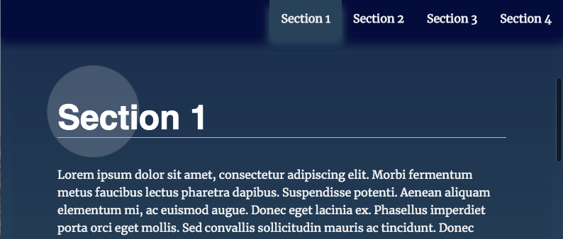

# Landing Page Example



This landing page is an example of the interaction between HTML, CSS, and JavaScript to handle dynamically-generated content when populating a page design. The code tracks users scroll position to update certain page characteristics while navigating the content.


## Usage

To view the sample page, just download or clone this repo:

```
git clone https://github.com/paulmreese/fend-landing-page.git
```

Then, open the `index.html` file in your internet browser to see the page in action!

## Special Thanks

[Hacker Noon](https://hackernoon.com/htmlcollection-nodelist-and-array-of-objects-da42737181f9) - ES6 nodeList to Array conversion syntax

[Flavio Copes](https://flaviocopes.com/add-click-event-to-dom-list/) - concise event listener syntax

[CSS-Tricks](https://css-tricks.com/snippets/jquery/smooth-scrolling/) - Tips for smooth JS scrolling
